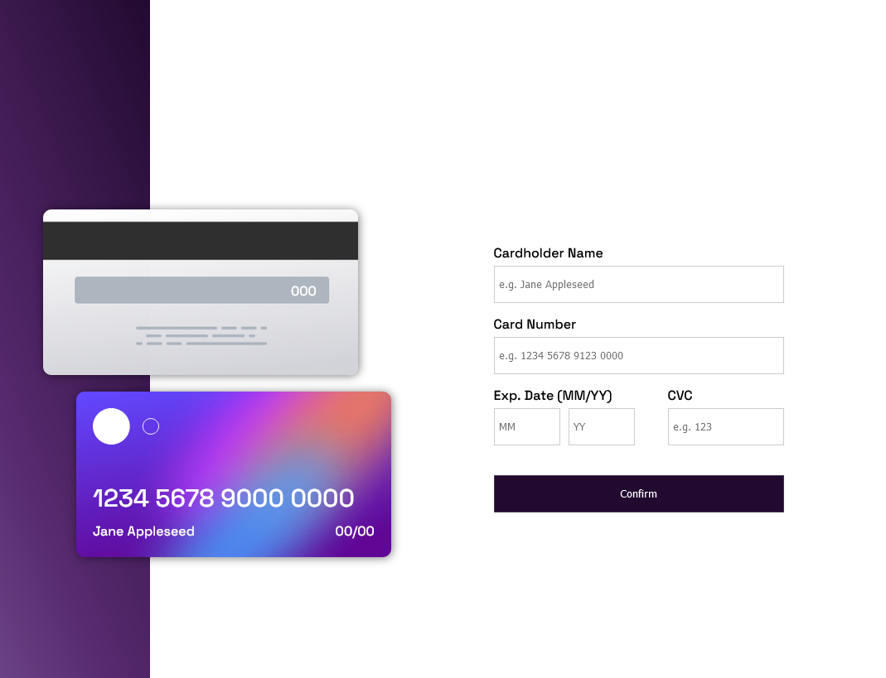

# Frontend Mentor - Interactive card details form 

This is a solution to the [Interactive card details form challenge on Frontend Mentor](https://www.frontendmentor.io/challenges/interactive-card-details-form-XpS8cKZDWw). 

## Table of contents

- [Frontend Mentor - Interactive card details form solution](#frontend-mentor---interactive-card-details-form-solution)
  - [Table of contents](#table-of-contents)
  - [Overview](#overview)
    - [The challenge](#the-challenge)
    - [Screenshot](#screenshot)
    - [Links](#links)
  - [My process](#my-process)
    - [Built with](#built-with)
    - [What I learned](#what-i-learned)
    - [Continued development](#continued-development)
    - [Useful resources](#useful-resources)
  - [Author](#author)

## Overview

### The challenge

Users should be able to:

- Fill in the form and see the card details update in real-time
- Receive error messages when the form is submitted if:
  - Any input field is empty
  <!-- - The card number, expiry date, or CVC fields are in the wrong format -->
- View the optimal layout depending on their device's screen size
- See hover, active, and focus states for interactive elements on the page

### Screenshot

### Links

- Solution URL: [Solution at Frontend Mentor](https://www.frontendmentor.io/solutions/interactive-card-details-form-solution-5a4eqEIrUk)
- Live Site URL: [Interactive Card Details - Deployment](https://interactive-card-details-form-plum.vercel.app/)

## My process

My experience was pretty good developing this challenge. All about this project taught me something and, believe me, I really had to learn some hard contents (at least for me) to accomplish this task. I wish I could say that was easy. But it wasn't. And I will talk a bit about this process further ahead.

### Built with

- Semantic HTML5 markup
- CSS custom properties
- Flexbox
- CSS Grid
- Media queries
- Javascript for DOM Manipulation

### What I learned

It is a simple project in a first look, but, when you stop and think about all the details the application must attend, so you realize that its a high challenge. So I put myself to work on it and spent a bunch of hours practicing concepts that I already "learn", but I've never applied before. I could understand:

  - How the eventlisteners works on input fields;
  - I was able to apply diferents iterations methods and this help a lot to validate some infos from user side; and
  - DOM manipulating was far the most important thing to understand when passing input values to the side card on page.
   
  With these tools I could finish the project and learned better by practicing .

### Continued development

Well, I can easy say that in this project I struggled a lot with CSS positioning properties. Seriously, that makes me realize how bad I am on that. Or I was(spoiler alert: I had to learn it to finish the challenge). Actually,  I read and watched a ton of classes about it but never really practiced positioning. It could seems foolish, but that was the struggle I had to go through to show me where I can get better and now I really know. Its my main objective from now on and you can see my progress very soon in another project.

### Useful resources

- [CSS Grid by Wes Bos](https://cssgrid.io/) - This video series helped me a lot when I was struggling with positioning elements on the screen.

## Author

- Github - [Eduardo Souza - Github Profile](https://github.com/edusantsouza)
- Frontend Mentor - [@edusantsouza](https://www.frontendmentor.io/profile/edusantsouza)

